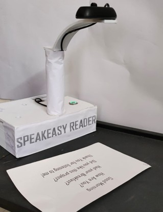
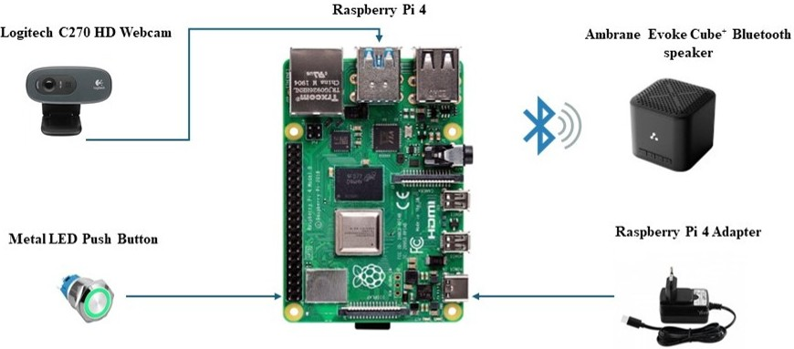
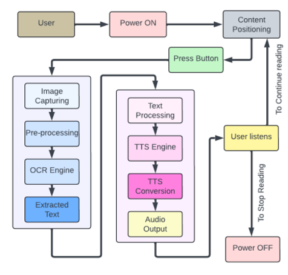
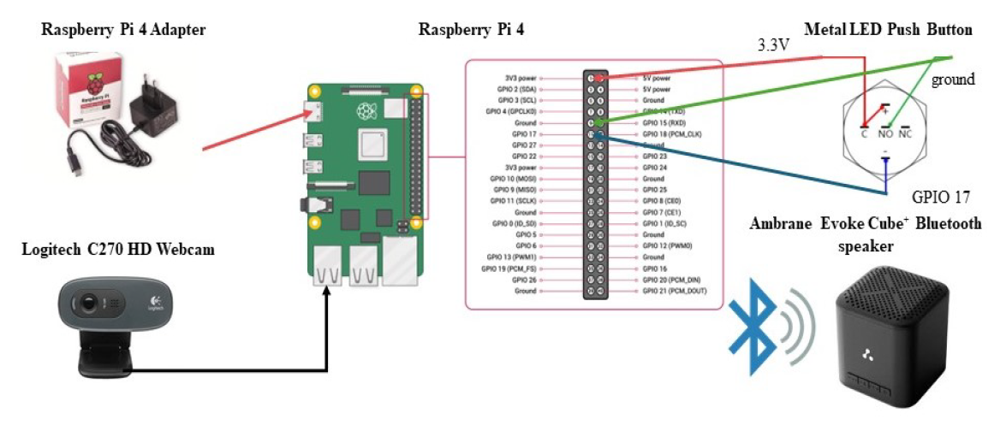

# 🗣️ Smart Reader for the Visually Impaired

<p align="center">
  
  
  
  
  
</p>

<p align="center">
  
  
</p>

<p align="center">
  Raspberry Pi based OCR Text-to-Speech assistive device for visually impaired users
</p>

---

## 📋 Table of Contents

- [Overview](#-overview)
- [Project Context](#-project-context)
- [Features](#-features)
- [System Architecture](#-system-architecture)
- [Hardware Components](#-hardware-components)
- [Software Stack](#-software-stack)
- [How It Works](#-how-it-works)
- [Performance Metrics](#-performance-metrics)
- [Installation & Setup](#-installation--setup)
- [Usage](#-usage)
- [Results & Gallery](#-results--gallery)
- [Limitations](#-limitations)
- [Future Enhancements](#-future-enhancements)
- [Research Publication](#-research-publication)
- [Contributors](#-contributors)
- [License](#-license)
- [Acknowledgments](#-acknowledgments)
- [Contact & Support](#-contact--support)

---

## 🌟 Overview

Smart Reader for the Visually Impaired is an assistive embedded system designed to help visually impaired users read printed text independently by converting it into speech output.

Built on the Raspberry Pi platform, the system captures text using a camera, preprocesses the image using OpenCV, extracts text using Tesseract OCR, and converts it into audio using Festival Text-to-Speech.

This project was developed as a **Final Year Major Project** in Electronics & Communication Engineering at **REVA University, Bengaluru**, and was published at **IEEE ICCCNT 2024, IIT Mandi**.

---

## 🎯 Project Context

- **Project Type:** Final Year Major Project
- **Department:** Electronics & Communication Engineering (ECE)
- **Institution:** REVA University, Bengaluru, India
- **Research Publication:** IEEE ICCCNT 2024
- **Conference Venue:** IIT Mandi, India
- **IEEE Paper Link:** [View on IEEE Xplore](https://ieeexplore.ieee.org/document/10723858)

---

## ✨ Features

- **Real-Time Text Recognition** using OCR
- **One-Button Operation** for simple user interaction
- **Audio Output** through speaker for accessibility
- **Fast Processing** with practical response time
- **Portable Embedded System** based on Raspberry Pi
- **Affordable Assistive Solution** using low-cost hardware
- **Integrated Hardware-Software Design**
- **Designed for Accessibility and Independence**

---

## 🏗️ System Architecture

### High-Level Flow

```text
User Button Press → Image Capture → Image Preprocessing → OCR → Text-to-Speech → Audio Output
```

### Hardware Architecture

```text
┌─────────────────────┐
│   Push Button       │
│   (GPIO17)          │
└──────┬──────────────┘
       │
       ▼
┌─────────────────────┐      ┌─────────────────────┐
│  Raspberry Pi 4     │◄────►│  Logitech C270      │
│  Model B            │      │  HD Webcam          │
└──────┬──────────────┘      └─────────────────────┘
       │
       ▼
┌─────────────────────┐
│  Bluetooth Speaker  │
│  (Audio Output)     │
└─────────────────────┘
```

### Software Pipeline

```text
┌──────────────┐    ┌──────────────┐    ┌──────────────┐    ┌──────────────┐
│    Camera    │───►│   OpenCV     │───►│  Tesseract   │───►│   Festival   │
│   Capture    │    │  Processing  │    │     OCR      │    │     TTS      │
└──────────────┘    └──────────────┘    └──────────────┘    └──────────────┘
       │                    │                    │                    │
       ▼                    ▼                    ▼                    ▼
 Image Capture      Image Enhancement      Text Extraction       Audio Output
```

---

## 🔧 Hardware Components

| Component | Specification | Purpose |
|---|---|---|
| Microprocessor | Raspberry Pi 4 Model B | Main processing unit |
| Camera | Logitech C270 HD Webcam | Image capture |
| Input Interface | Push Button (GPIO17) | User trigger |
| Audio Output | Bluetooth Speaker | Voice playback |
| Power Supply | 5V / 3A Adapter | System power |
| GPIO Connection | GPIO17 with pull-up | Button interface |
| Enclosure | Custom housing | Device protection |

---

## 💻 Software Stack

| Layer | Technology | Purpose |
|---|---|---|
| Operating System | Raspberry Pi OS | Base operating system |
| Programming Language | Python | Core application logic |
| Image Processing | OpenCV | Preprocessing and enhancement |
| OCR Engine | Tesseract / Pytesseract | Text extraction |
| TTS Engine | Festival | Speech generation |
| GPIO Control | RPi.GPIO | Button input handling |
| Image Utilities | Pillow (PIL) | Image handling |

### Key Python Libraries

```python
import cv2
import pytesseract
import RPi.GPIO as GPIO
import subprocess
from PIL import Image
from time import sleep
```

---

## ⚙️ How It Works

### 1. Initialization
- Raspberry Pi boots and loads the required libraries
- GPIO pin is configured for button input
- Camera module is initialized

### 2. User Interaction
- User places printed text under the camera
- User presses the push button

### 3. Image Capture
- Webcam captures the image
- Captured image is stored for processing

### 4. Preprocessing
- Convert image to grayscale
- Apply blur to reduce noise
- Improve readability for OCR

### 5. OCR Processing
- Preprocessed image is passed to Tesseract
- Text is extracted from the image

### 6. Text-to-Speech
- Extracted text is passed to Festival
- Audio output is generated

### 7. Output
- User hears the extracted text through the speaker
- System returns to standby for the next input

---

## 📊 Performance Metrics

| Metric | Value | Notes |
|---|---|---|
| OCR Accuracy | 97.13% | Based on tested samples |
| Processing Time | ~1.1 seconds | Per image |
| Language Support | English | Current version |
| Font Support | Printed text | Best with clear printed fonts |

### Test Conditions
- Font sizes: 10pt to 14pt performed best
- Indoor lighting conditions
- Printed documents, books, and labels
- Standard white/off-white paper

---

## 🚀 Installation & Setup

### Prerequisites

- Raspberry Pi 4
- Raspberry Pi OS installed
- USB webcam
- Push button
- Speaker / Bluetooth speaker
- Internet access for installing packages

### 1. Update Packages

```bash
sudo apt-get update
sudo apt-get upgrade -y
```

### 2. Install Dependencies

```bash
sudo apt-get install tesseract-ocr -y
sudo apt-get install festival -y
sudo apt-get install python3-pip python3-opencv -y
pip3 install pytesseract RPi.GPIO pillow
```

### 3. Enable Camera

```bash
sudo raspi-config
```

Then go to:

```text
Interface Options → Camera → Enable
```

### 4. GPIO Setup Example

```python
import RPi.GPIO as GPIO

BUTTON_PIN = 17
GPIO.setmode(GPIO.BCM)
GPIO.setup(BUTTON_PIN, GPIO.IN, pull_up_down=GPIO.PUD_UP)
```

### 5. Bluetooth Speaker Setup

```bash
sudo apt-get install bluetooth bluez bluealsa -y
bluetoothctl
```

Then run:

```text
power on
agent on
scan on
pair [MAC_ADDRESS]
connect [MAC_ADDRESS]
```

---

## 📖 Usage

### Run the Application

```bash
cd ~/smart-reader
python3 smart_reader.py
```

### Basic Usage Steps

1. Power on the Raspberry Pi
2. Wait for system initialization
3. Place printed text below the camera
4. Press the button
5. Listen to the spoken output

### Sample Code Structure

```python
#!/usr/bin/env python3
import cv2
import pytesseract
import RPi.GPIO as GPIO
import subprocess
from time import sleep

BUTTON_PIN = 17
GPIO.setmode(GPIO.BCM)
GPIO.setup(BUTTON_PIN, GPIO.IN, pull_up_down=GPIO.PUD_UP)

def capture_image():
    cap = cv2.VideoCapture(0)
    ret, frame = cap.read()
    cap.release()
    return frame

def preprocess_image(image):
    gray = cv2.cvtColor(image, cv2.COLOR_BGR2GRAY)
    blur = cv2.GaussianBlur(gray, (5, 5), 0)
    return blur

def extract_text(image):
    return pytesseract.image_to_string(image)

def text_to_speech(text):
    subprocess.call(['festival', '--tts'], input=text.encode())

def main():
    print("Smart Reader initialized. Press button to read.")
    try:
        while True:
            if GPIO.input(BUTTON_PIN) == GPIO.LOW:
                print("Button pressed! Capturing image...")
                image = capture_image()
                processed = preprocess_image(image)
                text = extract_text(processed)
                print(f"Text detected: {text}")
                text_to_speech(text)
                sleep(1)
    except KeyboardInterrupt:
        GPIO.cleanup()

if __name__ == "__main__":
    main()
```

---

## 📸 Results & Gallery

### Final Prototype

<p align="center">
  
</p>

The final assembled prototype integrates the Raspberry Pi, webcam, user input button, and audio output system into a compact assistive reading device.

### Hardware Architecture

<p align="center">
  
</p>

This diagram shows the core hardware structure of the Smart Reader system.

### Processing Flow Diagram

<p align="center">
  
</p>

The flow diagram explains the complete process from image capture to speech output.

### Hardware Connections

<p align="center">
  
</p>

This image illustrates how the Raspberry Pi, button, camera, and output systems are connected.

### Image Capture and Conversion

<p align="center">
  
</p>

This result shows the captured input and the corresponding OCR conversion flow.

### Accuracy and Speed Analysis

<p align="center">
  
</p>

This figure presents the observed OCR accuracy and processing speed performance.

### Social Relevance

<p align="center">
  
</p>

This highlights the need for accessible reading devices for visually impaired users.

---

## ⚠️ Limitations

- Limited support for handwritten text
- Reduced accuracy for very small font sizes
- Currently optimized mainly for English text
- Performance depends on lighting quality
- Complex document layouts may reduce OCR performance
- Blurry images can affect output quality

---

## 🔮 Future Enhancements

- Deep learning based OCR for better accuracy
- Support for multiple Indian languages
- Voice command support
- Rechargeable battery integration
- Mobile app connectivity
- QR and barcode recognition
- Currency and object identification
- Braille output support

---

## 📚 Research Publication

This project is associated with the following IEEE publication:

- **Title:** SpeakEasy Reader: OCR-Based Text-to-Speech Device for Assistive Reading
- **Conference:** IEEE ICCCNT 2024
- **Venue:** IIT Mandi
- **Paper Link:** [https://ieeexplore.ieee.org/document/10723858](https://ieeexplore.ieee.org/document/10723858)

### Citation

```bibtex
@inproceedings{harsha2024smartreader,
  title={Smart Reader: OCR-Based Assistive Device for Visually Impaired},
  author={Kuragayala Sree Harsha and Shivani Guru Naik and Md Tauseef},
  booktitle={2024 15th International Conference on Computing Communication and Networking Technologies (ICCCNT)},
  year={2024},
  organization={IEEE},
  doi={10.1109/ICCCNT61001.2024.10723858}
}
```

---

## 👥 Contributors

| Contributor | Role |
|---|---|
| Kuragayala Sree Harsha | Hardware architecture, OCR & TTS pipeline, Raspberry Pi programming |
| Shivani Guru Naik | Software development, testing, hardware integration, documentation, co-author |
| Md Tauseef | Component testing and deployment support |

---

## 📄 License

This project is licensed under the **MIT License**.  
See the [LICENSE](./LICENSE) file for details.

---

## 🙏 Acknowledgments

- REVA University, Bengaluru
- Department of ECE
- IEEE ICCCNT 2024 Conference Committee
- IIT Mandi
- OpenCV, Tesseract, and Festival open-source communities
- Raspberry Pi Foundation
- Users and testers who contributed feedback

---

## 📞 Contact & Support

**Shivani Guru Naik**  
📧 Email: [shivanigurunaik@gmail.com](mailto:shivanigurunaik@gmail.com)  
🐙 GitHub: [github.com/ShivaniGuruNaik](https://github.com/ShivaniGuruNaik)  
🎓 REVA University, Bengaluru  
📄 IEEE Publication: [View Paper](https://ieeexplore.ieee.org/document/10723858)

---

<p align="center">
  <b>Made with ❤️ for the visually impaired community</b><br>
  <sub>Empowering independence through technology</sub>
</p>

<p align="center">
  
  
  
</p>
